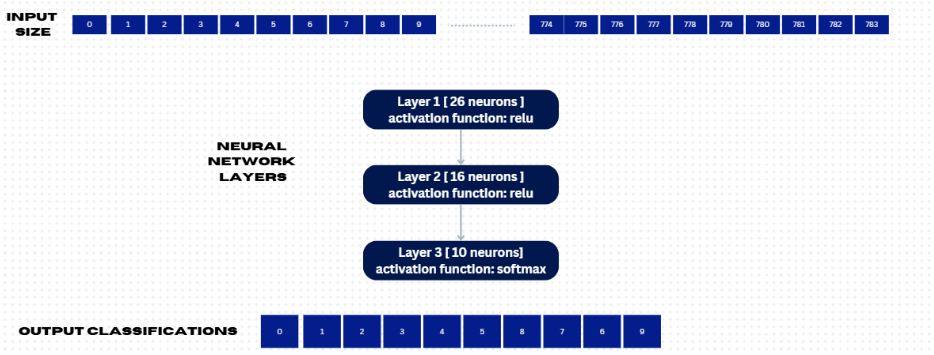
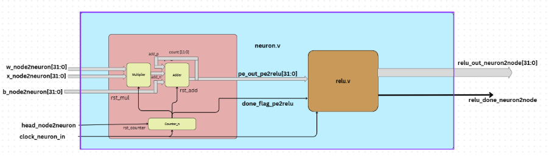
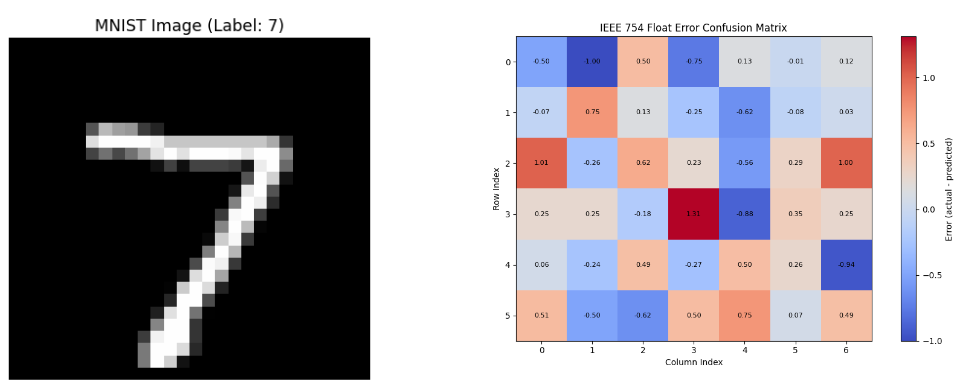
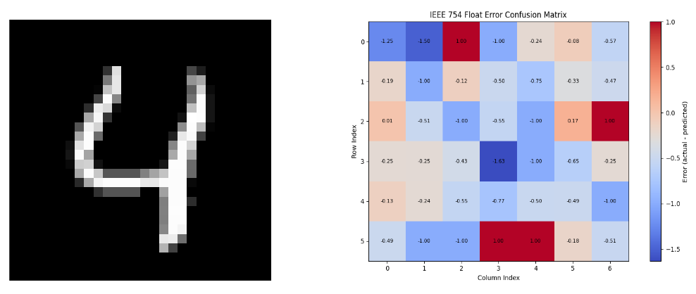
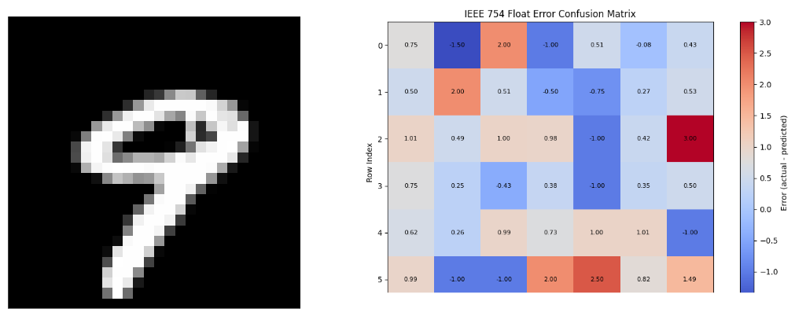

## Introduction

As AI expands into diverse applications, AI accelerators are key to processing data quickly and efficiently at scale. They help companies innovate faster and bring AI solutions to market sooner.

AI accelerators outperform traditional CPUs in three core areas:

- **Speed**: Significantly lower latency enables real-time responsiveness, essential in critical fields like healthcare and autonomous vehicles.
- **Efficiency**: 100x to 1000x more power-efficient, generating less heat and consuming less energy—ideal for both data centers and edge devices.
- **Design**: Heterogeneous architecture allows multiple processors to handle specialized tasks, boosting performance for demanding AI workloads.

## Objective

- Implement a neural network in **Verilog** for MNIST digit classification.
- Design a modular and scalable architecture entirely from scratch.
- Optimize for **computational efficiency**, **low latency**, and **minimal resource utilization**.

## Neural Network Architecture

This architecture defines a neural network designed for digit classification using the **MNIST dataset**. The model accepts a flattened 28×28 grayscale image as input and processes it through multiple layers to output probabilities for digits 0–9.

- **Input Layer**: Flattened 28×28 (784) grayscale image.
- **Hidden Layer 1**: 26 neurons with **ReLU** activation.
- **Hidden Layer 2**: 16 neurons with **ReLU** activation.
- **Output Layer**: 10 neurons with **Softmax** activation for digit classification.

The ReLU activation introduces non-linearity, enabling the network to learn complex patterns. The Softmax layer ensures the output is a valid probability distribution.

Once trained on the MNIST dataset, the model’s **weights and biases** are saved. These trained parameters serve as one of the input sets for the **hardware accelerator** implemented in Verilog.

## Neuron Module

A neuron is the core computational unit of a neural network. It takes multiple **weighted inputs**, adds a **bias**, and applies an **activation function** to produce an output.

During forward propagation, it performs:

## Neuron Computation

A single neuron's output is computed as:

$$
y_j = \text{ReLU}\left( \sum_{i=1}^{n} w_{ji} x_i + b_j \right)
$$

### Where:
- **n** — Number of input features  
- **xᵢ** — Input value *i*  
- **wⱼᵢ** — Weight connecting input *i* to neuron *j*  
- **bⱼ** — Bias term for neuron *j*  
- **yⱼ** — Output of neuron *j*  
- **ReLU** — Rectified Linear Unit activation function.

  

## Hardware Framework

The core of our hardware accelerator models neurons as fundamental units (in `neuron.v`) that compute weighted sums of inputs, add biases, and apply activation functions (e.g., ReLU) to introduce non-linearity.

To optimize resource usage, **10 neurons are grouped into a single node** (`node.v`), enabling hardware reuse and reducing area, power, and timing overhead.

### Key Optimizations:

- **Resource Sharing**: Shared processing units handle MAC operations and activations sequentially, minimizing redundant hardware.
- **Pipelining**: Stages like summation, activation, and normalization are pipelined for higher throughput without duplicating units.
- **Memory Efficiency**: Grouped neurons streamline weight and activation access, improving bandwidth and reducing interconnect complexity.
- **Scalability & Power Savings**: Modular nodes can be replicated for larger networks while minimizing dynamic power and maintaining efficiency.

## Memory Module

A unified memory module (`main_memory.v`) is used to store **inputs, weights, biases**, and **intermediate activations**, enabling efficient data access and minimizing redundant storage.

### Memory Partitioning:
- **Input Image**: Flattened 28×28 (784 values)
- **Layer 1**:  
  - Weights: 784 × 26  
  - Biases: 26  
- **Layer 2**:  
  - Weights: 26 × 16  
  - Biases: 16  
- **Output Layer**:  
  - Weights: 16 × 10  
  - Biases: 10  
- **Activations**: Buffers between layers for forward propagation

### Key Features:
- Centralized memory design for optimized **hardware resource usage**
- Structured addressing and potential **dual-port RAM** for simultaneous read/write
- Supports pipelined processing with minimal overhead

This design ensures high-throughput and streamlined data access across all neural network layers.

## Observations

To validate our hardware accelerator, we compared the **intermediate outputs** of each layer against those from the **pretrained software model**.

## Test Results

## Issues
- Softmax function has some issues
- Optimize the memory
- Synthesize on FPGA

